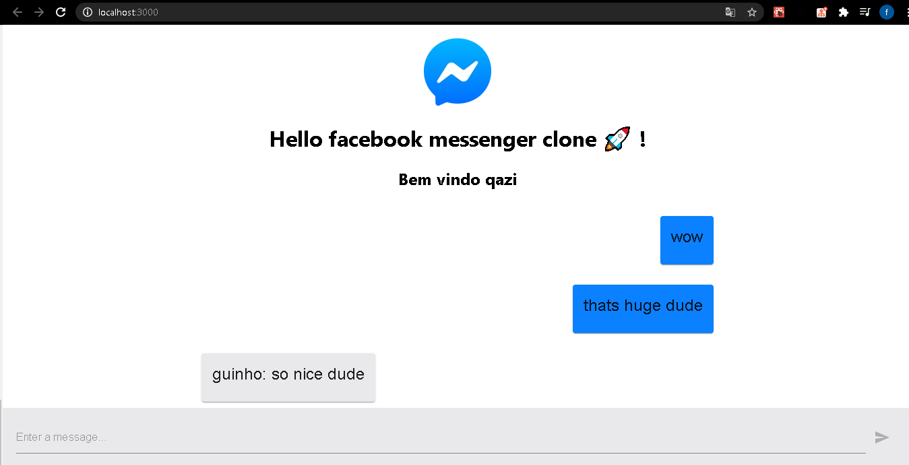
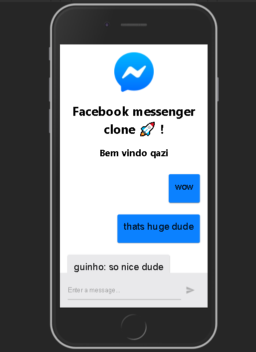

# Facebook messenger clone 

Aplicação criada com react.js e firebase,onde simula o chat do messenger do facebook

https://facebook-messenger-clone-c84d7.web.app/

## Principais tecnologias 
- React.js
- Firebase
- Material UI

## Layout

  
  
  

Esse projeto está sob a licença MIT. Veja o arquivo [LICENSE](https://github.com/Matheus-SS/facebook-messenger-clone/blob/master/LICENSE) para mais detalhes. 
